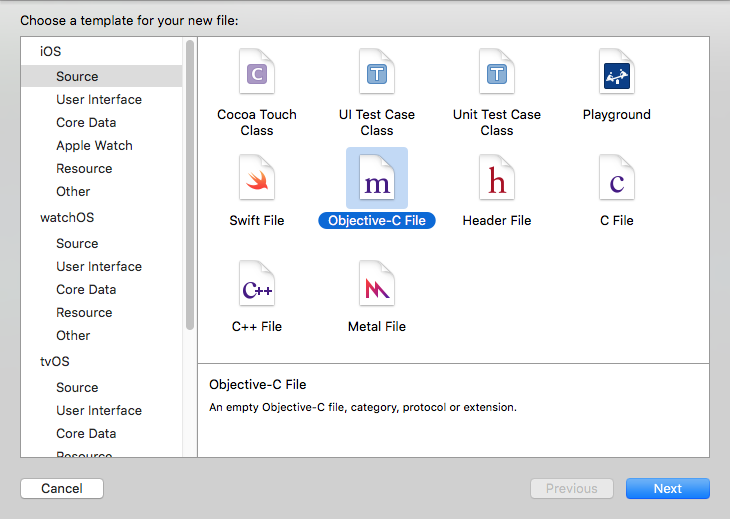
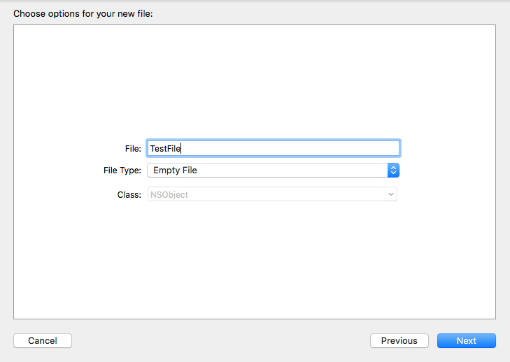
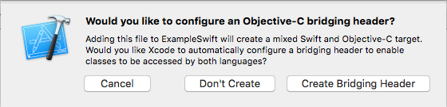
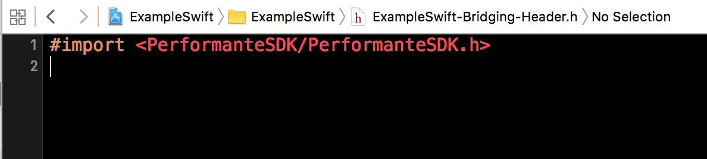

## The easiest way to create `Objective-C bridging header` in Swift project

### 1. Create Objective-C File

Go to File > New > File and select Objective-C File:

Click `Next` button. You'll be asked for name this file, you can name it whatever you like. 

Click `Next` button.

### 2. Create Objective-C bridging header

Then you'll see `dialogue with configure Objective-C bridging header`.

Click `Create Bridging Header`. 

### 3. Add import to created Objective-C bridging header

Now you can delete empty `Objective-C file` in above example - `TestFile.m`.
