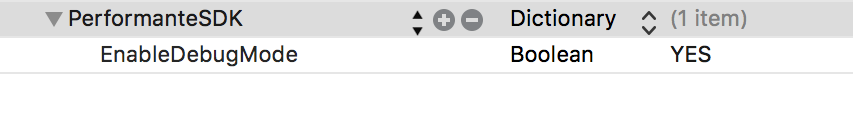

# Performante SDK for iOS


[](http://cocoadocs.org/docsets/PerformanteSDK/1.0/)

PerformanteSDK is a tool for tracking different events in your application.

## Compatibility:

* iOS 8.0 or later
* Swift and Objective-C

## Installation via Cocoapods

* Add this line to your Podfile:

```ruby
pod 'PerformanteSDK'
```

* And then execute:

```sh
$ pod install
```

##### In Swift project you need to add `Objective-C bridging header`. If you don't how to do it, explanation is <a href="https://github.com/elpassion/performante-sdk-ios/tree/master/How-to-add-Objective-C-bridging-header">**here**</a>.

## Import

Add import to your class where you want to use SDK

**Swift**

```swift
import PerformanteSDK
```

**Objective-C**

```obj-c
#import <PerformanteSDK/PerformanteSDK.h> or @import PerformanteSDK;
```

## Example usage - configure and sending events

**Swift**

```swift
let sdk = PFSDK.newWithProductId("Example-Swift", apiKey:"example-api-key")
sdk.sendAppStarted()
sdk.sendAppEvent("Custom_event")

```

**Objective-C**

```obj-c
PFSDK *sdk = [PFSDK newWithProductId:@"Example-Objective-C" apiKey:@"example-api-key"];
[sdk sendAppStarted];
[sdk sendAppEvent:@"Custom_event"];
```

Method `sendAppStarted` should be called when app was started.

Method `sendAppEvent:` is for sending different event.

## Mark existing user

When you don't want track existing user you can use method:

**Swift**

```swift
sdk.setExistingUser(true)
```

**Objective-C**

```obj-c
[sdk setExistingUser:YES];

```

Default value for this parameter is set to `false/NO`. When you set to `true/YES` user will not be tracked. Remember to configure this value before calling method `sendAppStarted`.

## Debug mode

If you want to make sure that you have correctly configured SDK you can enable debug mode. Add to your main plist file below code:

```
 <key>PerformanteSDK</key>
 <dict>
    <key>EnableDebugMode</key>
    <true/>
 </dict>
```

You can setup `true` or `false` value for key `EnableDebugMode`.



## Example applications

If you still have difficulty setting up the SDK, look at the Example applications in **<a href="https://github.com/elpassion/performante-sdk-ios/tree/master/ExampleSwift">Swift</a>** and **<a href="https://github.com/elpassion/performante-sdk-ios/tree/master/ExampleObjectiveC">Objective-C</a>**.

## License

The Apache License (Apache) - check included [LICENSE](LICENSE) file
